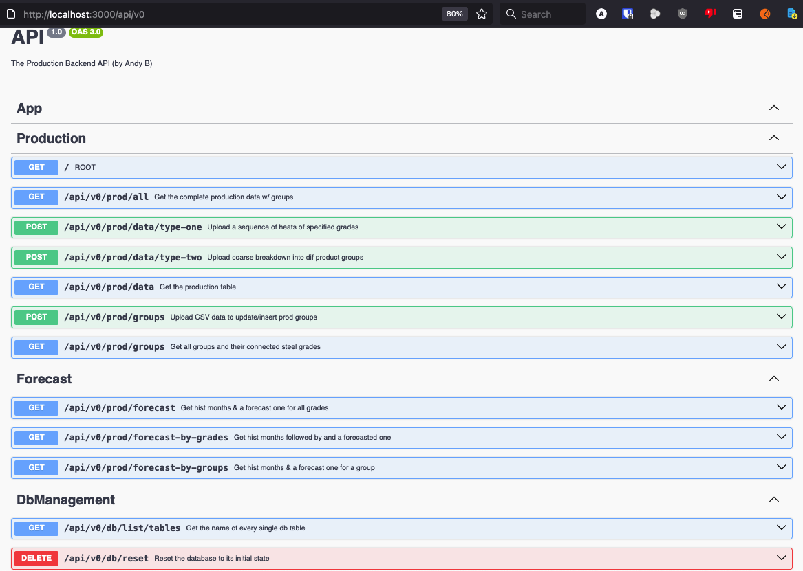
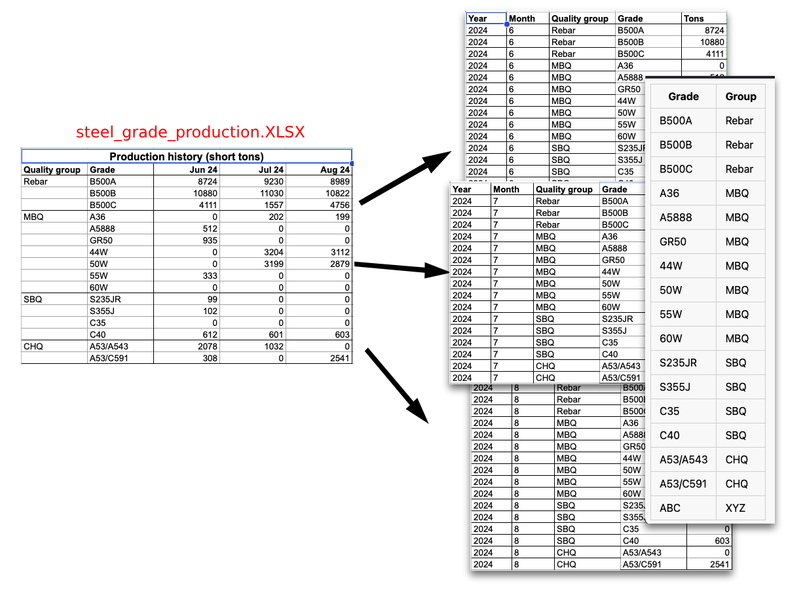
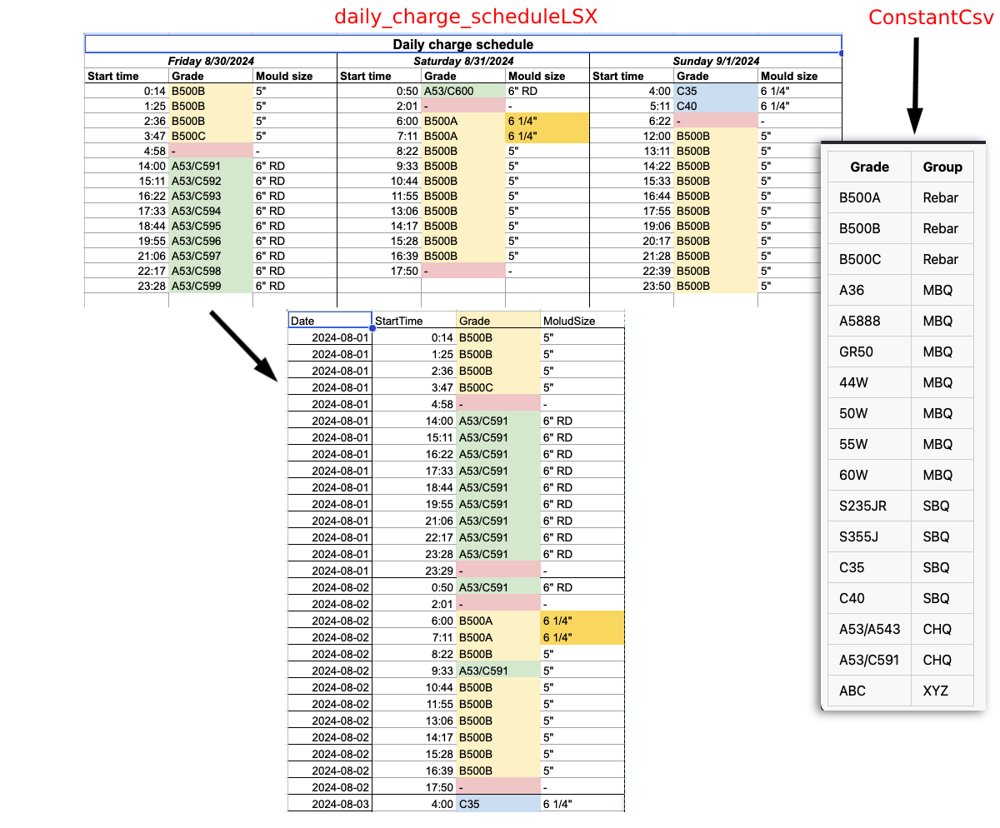

# Hiring Challenge Api

This is the _API solution_ I've build for the an imaginary plant production plant. Since this was open to any language/framework, I have decided to use the programming language **JavaScript** ( **TypeScript** ) and build the API with the **[NestJs](https://nestjs.com/)** framework and this project makes use of the **[Sqlite3 Database](https://www.sqlite.org/)**.

---

## Hiring Challenge Api: The Challenge

The challenge can be found below:

> Your task is to write a simple API and database schema for a steel plant's production plans.

> Depending on the kind of plan the customer wants to produce, steel production is specified either in terms of

> 1. A sequence of heats (batches of steel) of specified steel grades to be made each day
> 2. A coarse breakdown into different product groups. Each steel grade belongs to a specific product group, but each product group comprises many steel grades.

> However, ScrapChef requires a steel grade breakdown (number of heats of each grade) in order to run.

> We have provided some example input files, as well as the number of tons of each steel grade made in the last few months (you can assume each heat averages 100t of steel produced).

> The API should:

> 1. Accept these files and store them in your database schema (you may change them to a more friendly format before uploading)

> 2. Create an endpoint to forecast the September production in a format that ScrapChef can use. For this part of the task, there is no single correct answer. You should think about what the customer might reasonably want to produce based on the product group breakdown and the historical production.

> Where relevant, briefly document the business logic and the assumptions you are making.

> Feel free to ask any clarifying questions at any point.

---

## Hiring Challenge Api: Screenshots

Swagger GUI:



## Hiring Challenge Api: Samples

For sample CSV files ( and their related MarkDown versions ) see the **`./samples/`** folder.

---

## Hiring Challenge Api: Prerequisites

- [Node.js](https://nodejs.org/en/download/) (v22 or higher)
- [npm](https://www.npmjs.com/get-npm)

---

## Hiring Challenge Api: Installation

1. **Clone the repository:**

   ```bash
   git clone https://github.com/...
   ```

2. **Navigate to the project directory:**

   ```bash
   cd ...
   ```

3. **Install the dependencies:**

   ```bash
   npm install
   ```

---

## Hiring Challenge Api: How to Run

### Hiring Challenge Api: How to Run: Development

To run the application in development mode with watch mode enabled, use the following command:

```bash
npm run start:dev
```

The application will be available at `http://localhost:3000`.

### Hiring Challenge Api: How to Run: Production

To run the application in production mode, you first need to build the project:

```bash
npm run build
```

Then, start the production server:

```bash
npm run start:prod
```

---

## Hiring Challenge Api: Forecast

For calculating the forecast my initial approach was to use a simple average of all previous months. However, since the result was far away from the provided data and since I have learned that factories use more advanced algorithms I have decided to use a more advanced algorithm.

I have used the following Simple Moving Average algorithm:

```py
SMA_t = (X_*(t-2) + X_*(t-1) + X_t) / 3
```

Where:

- **`SMA_t`** = Simple Moving Average at time _t_ - which in this case is September ( 2024 )

- **`X_t`** = Value at current period

- **`X_(t-1)`** = Value at previous period

- **`X_(t-2)`** = Value two periods ago

---

## Hiring Challenge Api: Conversion to Friendly Formats

In order to make things simple and avoid the use of various specific NPMs I have decided to convert the given files to CSVs, more or less, as described below:





---

---
